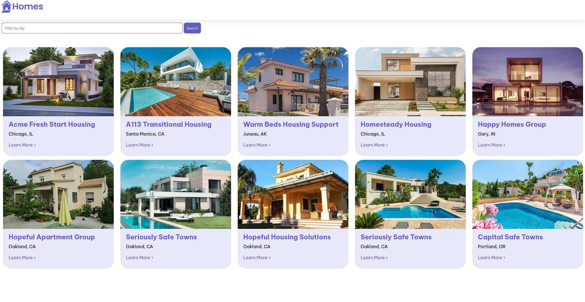
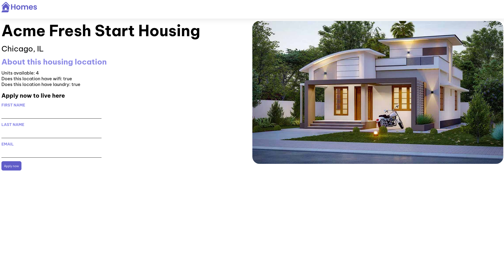

### Creación de una página web inmobiliaria en Angular siguiendo un tutorial

He seguido el tutorial de la página oficial de Angular para crear la primera app.

Pagina web:
https://angular.dev/tutorials/first-app

Resultado final:

La landing page enseña las casas que hay publicadas.

En caso de querer ver una casa de manera detallada, clickamos en "Learn More.

